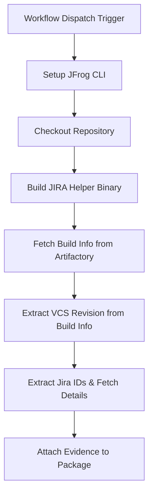

# **Jira Ticket Tracking Evidence Example**

This repository provides a working example of a GitHub Actions workflow that automates Jira ticket tracking and validation. It extracts Jira ticket IDs from git commit messages, validates their existence and workflow transitions, and attaches the resulting ticket summary as signed, verifiable evidence to the package in **JFrog Artifactory**.

This workflow is an essential pattern for DevSecOps and project management, creating a traceable, compliant, and auditable software development process that links code changes to Jira tickets.

## **Key Features**

* **Automated Jira ID Extraction**: Extracts Jira ticket IDs from git commit messages using configurable regex patterns.
* **Ticket Validation**: Validates that extracted Jira tickets exist and retrieves their current status and metadata.
* **Workflow Transition Tracking**: Captures the complete workflow history and transitions for each ticket.
* **Evidence Generation**: Creates a jira-results.json predicate file with comprehensive ticket information.
* **Signed Evidence Attachment**: Attaches the ticket tracking results to the corresponding package version in Artifactory using `jf evd create`, cryptographically signing it for integrity.
* **Consolidated Tool**: All functionality is now consolidated into a single Go application for simplicity and maintainability.

## **Workflow Overview**

The following diagram illustrates the sequence of operations performed by the GitHub Actions workflow.



## **Architecture**

### **Components**

1. **GitHub Actions Workflow** (`.github/workflows/create-jira-evidence.yml`)
   - Orchestrates the complete CI/CD process
   - Manages environment variables and secrets
   - Triggers JIRA evidence gathering

2. **JIRA Helper Application** (`helper/main.go`)
   - Consolidated Go application for all JIRA operations
   - Extracts JIRA IDs from git commits
   - Fetches comprehensive ticket details from JIRA API
   - Generates structured JSON output

## **Prerequisites**

Before running this workflow, you must have:

* JFrog CLI 2.65.0 or above (installed automatically in the workflow)
* An Artifactory repository (e.g., jira-evidence-repo)
* A private key and a corresponding key alias configured in your JFrog Platform for signing evidence
* Access to a Jira instance with API credentials
* Go 1.21 or later (for building the helper application)

## **Configuration**

### **GitHub Secrets**

Navigate to Settings > Secrets and variables > Actions and create the following secrets:

| Secret Name | Description |
| :---- | :---- |
| ARTIFACTORY_ACCESS_TOKEN | A valid JFrog Access Token with permissions to read, write, and annotate in your target repository. |
| PRIVATE_KEY | The private key used to sign the evidence. This key corresponds to the alias configured in JFrog Platform. |
| JIRA_USERNAME | The username of the Jira user account used for API authentication. |
| JIRA_API_TOKEN | The API token for the Jira user account. Generate this from your Jira account settings. |

### **GitHub Variables**

Navigate to Settings > Secrets and variables > Actions and create the following variables:

| Variable Name | Description | Example Value |
| :---- | :---- | :---- |
| ARTIFACTORY_URL | The base URL of your JFrog Platform instance. | https://mycompany.jfrog.io |
| JIRA_URL | The base URL of your Jira instance. | https://mycompany.atlassian.net |
| EVIDENCE_KEY_ALIAS | The alias for the public key in JFrog Platform used to verify the evidence signature. | my-signing-key-alias |

### **Workflow Environment Variables**

The workflow automatically sets these environment variables for the JIRA helper application:

| Variable Name | Description | Value |
| :---- | :---- | :---- |
| JIRA_ID_REGEX | Regex pattern to extract Jira IDs from commit messages | `[A-Z]+-[0-9]+` |
| JIRA_API_TOKEN | JIRA API token (from secrets) | `${{ secrets.JIRA_API_TOKEN }}` |
| JIRA_URL | JIRA instance URL (from variables) | `${{ vars.JIRA_URL }}` |
| JIRA_USERNAME | JIRA username (from secrets) | `${{ secrets.JIRA_USERNAME }}` |

You can modify these by editing the env block in `.github/workflows/create-jira-evidence.yml`.

## **Usage**

### **Running the Workflow**

1. Navigate to the **Actions** tab of your forked repository.
2. In the left sidebar, click on the **Create Jira evidence** workflow.
3. Click the **Run workflow** dropdown button. You can leave the default branch selected.
4. Click the green **Run workflow** button.

### **Workflow Inputs**

- **build_name**: Build name for the evidence (as stored in Artifactory) - **Required**
- **build_number**: Build number for the evidence (as stored in Artifactory) - **Required**
- **fetch_depth**: Number of previous commits to fetch (default is 10) - **Optional**

The workflow automatically fetches the VCS revision (commit hash) from the build info in Artifactory, eliminating the need to manually specify a commit. The helper processes this specific commit to extract JIRA IDs.

## **Output Schema**

The workflow generates a structured JSON file (`transformed_jira_data.json`) with the following schema:

```json
{
  "tasks": [
    {
      "key": "EV-123",
      "status": "In Progress",
      "description": "Task description",
      "type": "Task",
      "project": "EV",
      "created": "2020-01-01T12:11:56.063+0530",
      "updated": "2020-01-01T12:12:01.876+0530",
      "assignee": "John Doe",
      "reporter": "Jane Smith",
      "priority": "Medium",
      "transitions": [
        {
          "from_status": "To Do",
          "to_status": "In Progress",
          "author": "John Doe",
          "author_user_name": "john.doe@company.com",
          "transition_time": "2020-07-28T16:39:54.620+0530"
        }
      ]
    }
  ]
}
```

## **Jira ID Extraction Patterns**

The workflow supports configurable regex patterns for extracting Jira IDs from commit messages. Common patterns include:

* **Simple Project Key**: `(EV-\d+)` - Matches tickets like EV-123, EV-456
* **Multiple Projects**: `((EV|PROJ|BUG)-\d+)` - Matches tickets from multiple projects
* **Case Insensitive**: `(?i)(ev-\d+)` - Matches case variations like ev-123, EV-123

## **Error Handling**

The workflow includes comprehensive error handling:

* **Invalid Jira IDs**: Tickets that don't match the configured regex pattern are logged and skipped
* **Non-existent Tickets**: Tickets that don't exist in Jira are marked as "Error" in the results
* **API Failures**: Network or authentication issues are logged with appropriate error messages
* **Empty Results**: If no valid Jira IDs are found, the workflow continues with an empty result set

## **Technical Implementation**

For detailed technical information about the JIRA helper application, including:

- Command-line options and usage
- Environment variables
- Building and deployment
- API integration details
- Error handling specifics

Please refer to the [helper directory README](helper/README.md).


### **How It Works: A Step-by-Step Breakdown** 

#### **1\. Build Helper Application**

The workflow begins by setting up Go and compiling the custom `helper/main.go` application. This binary contains all the logic for parsing git commits and interacting with the Jira API.

#### **2\. Fetch Build Info and Extract VCS Revision**

The workflow automatically retrieves the VCS revision from the build info:

```bash
# Fetch build info from Artifactory using JFrog CLI
# The CLI handles authentication automatically
VCS_REVISION=$(jf rt curl -X GET "/api/build/$build_name/$build_number" -s | \
  jq -r '.buildInfo.vcs[0].revision // empty')
```

This eliminates the need to manually specify commit hashes. The build info must contain VCS information for this to work.


#### **3\. Extract and Validate Jira Data**

This is the core logic step. The compiled Go helper is executed, using the VCS revision automatically extracted from the build info. The application extracts all matching Jira IDs from the commit, queries the Jira API for their details, and generates the `transformed_jira_data.json` file.

```
# In directory jira/helper
echo "Processing JIRA details for commit: $VCS_REVISION"
./main "$VCS_REVISION"  # Processes the specific commit, outputs to transformed_jira_data.json
```

---

#### **4\. Attach Signed Evidence to Build**

This final step uses `jf evd create --build-name` to attach the Jira ticket summary to the **build information**. This creates a verifiable link between the CI process itself and the project management tickets that authorized the code changes within it.

```
jf evd create \
    --build-name $BUILD_NAME \
    --build-number ${{ github.run_number }} \
    --key "${{ secrets.PRIVATE_KEY }}" \
    --key-alias "${{ vars.EVIDENCE_KEY_ALIAS }}" \
    --predicate ./jira/helper/transformed_jira_data.json \
    --predicate-type http://atlassian.com/jira/issues/v1
```


## **References**

* [Jira REST API Documentation](https://developer.atlassian.com/cloud/jira/platform/rest/v3/)
* [JFrog Evidence Management](https://jfrog.com/help/r/jfrog-artifactory-documentation/evidence-management)
* [JFrog CLI Documentation](https://jfrog.com/getcli/)
* [Git Commit Message Conventions](https://www.conventionalcommits.org/)
